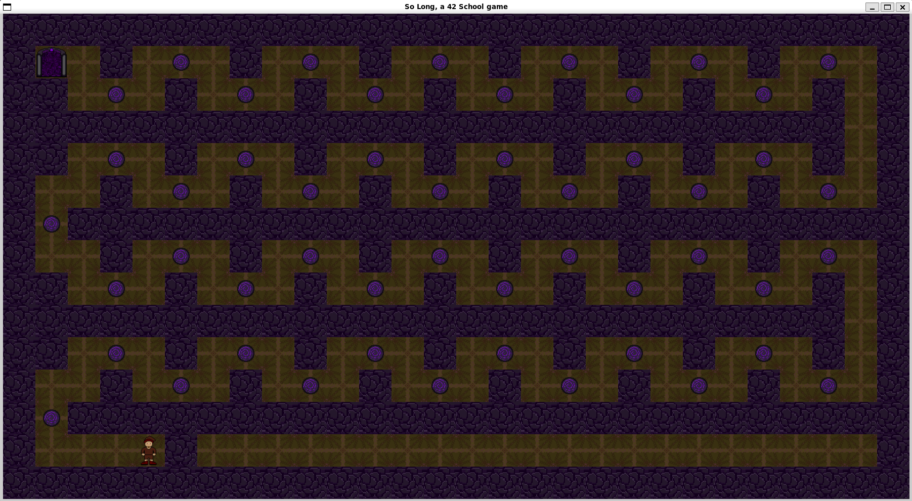

## so_long é um projeto da Escola 42 que envolve a criação de um jogo 2D simples. O objetivo é desenvolver habilidades em programação C, manipulação de gráficos e lógica de jogos. É utilizada a biblioteca MinilibX, fornecida pela 42, para renderizar gráficos e interagir com o jogador. O jogo consiste em controlar um personagem, coletar itens e alcançar a saída de um mapa.

### Data de início:
Eu iniciei o so_long dia 15 de Dezembro de 2024 (15/12/2024).
### Data de entrega:
Validei o projeto no dia 11 de Janeiro de 2025 (11/01/2025).


# RUNNING SO_LONG

## Requirements
#### - Linux, macOS or Windows with WSL installed
#### - cc or another compatible compiler
#### - 'make' installed
#### - 'lX11' installed (see the end of readme)
### 1 - Clone this repository
```bash
git clone git@github.com:vgomes-p/so_long-42.git
```

### 2 - Get into the project dir
```bash
cd so_long-42/project
```

### 3 - Run the command make
```bash
make
```

### 4 - Now call the program and map you want to play
The maps you can play are the following:
#### Map test:
```bash
./so_long maps/maptest.ber
```
#### Not So Long:
```bash
./so_long maps/not_so_long.ber
```
#### So Long:
```bash
./so_long maps/so_long.ber
```
#### Down the Witches' Road:
```bash
./so_long maps/downthewitchesroad.ber
```

# CLEANING SO_LONG
### 1 - Go to the main dir
```bash
cd so_long-42/project
```
### 2 - Run the command clean or full clean
```bash
make clean
```
or
```bash
make fclean
```

### 3 - Close the terminal
```bash
exit
```
# INSTALLING lX11
### 1 - Run the following commands
### Linux and Windows with WSL installed
```bash
sudo apt-get update
```
```bash
sudo apt-get install libx11-dev
```
### macOS
```bash
brew install libx11
```